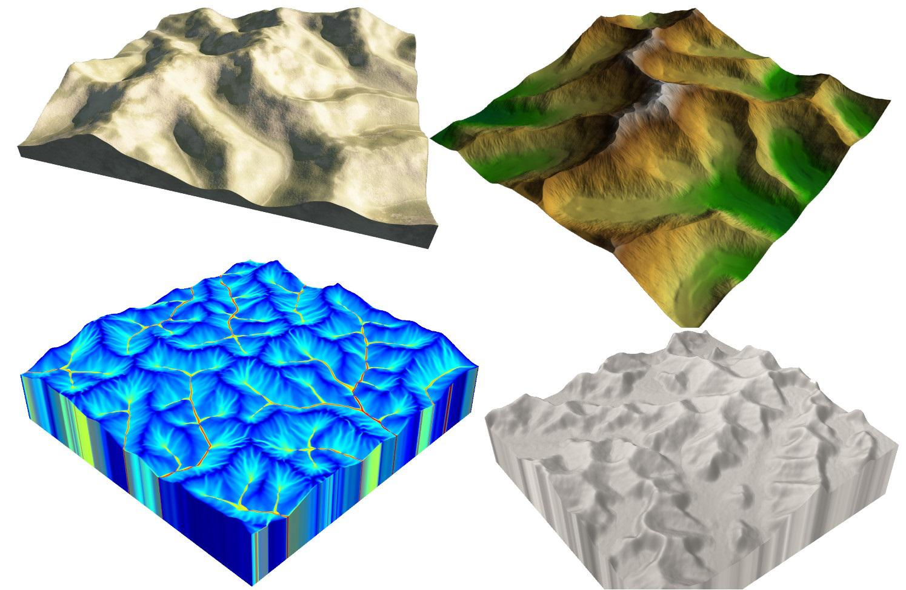

# Génération procédurale cours

Ce dépôt contient des exemple implémentations qui servent d'introduction sur la génération procédurale avec: Simple room placement, BSP, Cellular Automata, puis Noise

## Simple room placement
Place simplement des rectangles aléatoirements pour ensuite connecter des couloirs entre chaque rectangle

  

## BSP (Binary Space Partition)
Même objectif que le simple room placement mais en ajoutant de la récursivité, c'est a dire que la fonction s'appelle elle même pendant un nombre donné d'itération

  

## Cellular Automata
Le jeu de la vie de Conway utilise le cellular automata. L'objectif est de créer des regles simple sur une grille où une cellule évolue en fonction de ses voisines a chaque itération. Ca permet d'obtenir par exemple des covarnes sur un jeu en jouant avec le nombre d'itération

  

## Noise
Solution la plus optimisé et complexe pour la génération procédurale. Permet de généré des terrains complexe. On génère un "bruit" qui a des valeurs entre 0 et 1 sur une taille donnée et on le lie par exemple aux reliefs d'une carte (le 0 corresponds au sol et le 1 a la hauteur max possible des montagnes)

  

## Les class :

### FastNoiseLite
Permet d'implémenter l'algorithme de bruit (OpenSimplex, Perlin ect...). Utilisé pour générer des valeurs de hauteur

### FastNoiseLite
C'est une class abstraite qui définit la structure pour toutes les méthodes de génération

### ProceduralGridGenerator
Permet de généré une grid et d'exposer des parametres comme la seed, le delai de chaque étape, le choix de la méthode de génération

### SimpleRoomPlacement
Génère des rectangle aléatoirement en vérifiant si on peut les poser ou non puis connecte chaque salle avec la précedente via des couloirs en L

### BSP 
On coupe une zone en deux de manière recursive (en rappelant la méthode plusieurs fois) jusqu'a une taille. On optient pleins de petites zones, on génère ensuite une salle dans chaque zone puis on les relies

### Cellular automata
On initialise une des cellules de différents type aléatoirement (Grass et water ici) sur un espace donnée. On itère dans cette zone en modifiant une cellule en fonction de ces voisines plusieurs fois jusqu'a l'optention d'un rendu voulu (plusieurs iles, caverne, zone organique)

### Noise
On instancie FastNoiseLite avec une seed (valeur qui fait varié l'aléatoire). Pour chaque coordonnée du noise, on récupère le bruit (de -1 a 1), puis on transpose cette valeur sur une carte en metant par exemple les valeurs proches de -1 en "Grass" et les valeurs proche de 1 en "Water". Cela permet de créer des biomes variés en jouant sur les paramètres

## Comment l'utiliser
Importer / cloner le projet dans Unity.
Placer un GameObject avec le composant ProceduralGridGenerator.
Dans le gameObject, sélectionner la méthode de generation entre : SimpleRoomPlacement, BSP, CelularAutomata et NoiseGenerator.
Renseigner des parametres comme le Seed, le Step Delay ou d'autres particuliers a votre méthode de generation
Lancer le projet

