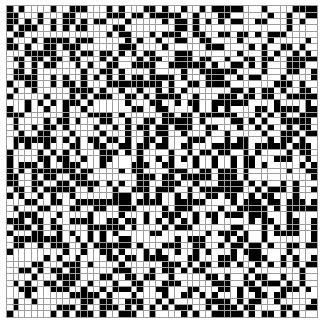

# Génération procédurale cours

Ce dépôt contient des exemple implémentations qui servent d'introduction sur la génération procédurale avec: Simple room placement, BSP, Cellular Automata, puis Noise

## Simple room placement
Place simplement des rectangles aléatoirements pour ensuite connecter des couloirs entre chaque rectangle

  

## BSP (Binary Space Partition)
Même objectif que le simple room placement mais en ajoutant de la récursivité, c'est a dire que la fonction s'appelle elle même pendant un nombre donné d'itération

  

## Cellular Automata
Le jeu de la vie de Conway utilise le cellular automata. L'objectif est de créer des regles simple sur une grille où une cellule évolue en fonction de ses voisines a chaque itération. Ca permet d'obtenir par exemple des covarnes sur un jeu en jouant avec le nombre d'itération

  

## Noise
Solution la plus optimisé et complexe pour la génération procédurale. Permet de généré des terrains complexe. On génère un "bruit" qui a des valeurs entre 0 et 1 sur une taille donnée et on le lie par exemple aux reliefs d'une carte (le 0 corresponds au sol et le 1 a la hauteur max possible des montagnes)

  

